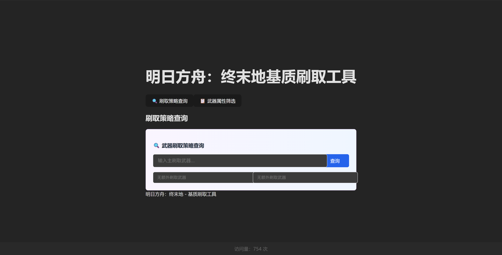

# 明日方舟：终末地基质刷取工具

这是一个辅助明日方舟：终末地中基质刷取的工具，用于计算基质刷取的最优解。

本网站基于react框架开发，使用claude辅助开发。

网站地址：https://alpacabaka.github.io/ArknightsEndfieldEssencesTools/

github地址：https://github.com/AlpacaBAKA/ArknightsEndfieldEssencesTools

## 使用方法

进入网页后页面如图，默认停留在刷取策略查询界面。

可以通过上方的按钮选择**刷取策略**面板或者**武器属性筛选**面板。

### 1. 刷取策略计算

本功能用于计算刷取基质最优解。

在最中央的输入框中输入需要刷取的武器，如果有其他需要同时刷取的武器，可以填写在下方的任意一个输入框中。最多支持计算同时刷取3个武器的情况。

搜索完成后，可以通过上方的“最优策略判定”按钮切换判定策略。目前有两个策略：①搜索结果包括**5星武器和6星武器**；②搜索结果**仅包括6星武器**

同时，在网页中添加了一个显示主要刷取武器的信息窗，可以随意拖动，方便管理员们使用浏览器小窗。

### 2. 武器属性筛选

本功能用于计算哪些副本可以同时刷取多个武器的基质。同时，也可以在刷取基质后通过属性筛选快速查询有无满足的基质。

在主页面点击“武器属性筛选”页面后，即可进入本功能页面。本页面主体为一个表格和筛选条件。

通过选择筛选条件可以快速筛选武器。同时，点击表头也可以按照选择的表头属性进行排序。默认排序方式为id。

在表格最左侧的复选框可以选择希望刷取的武器。随后拉到页面最下方，会显示计算结果———能够刷取的地点和能够固定的词条。

在这个版本中，允许玩家同时查询多个属性，如多个武器类型、多个基础属性、多个附加属性等。

## 功能反馈

如果你在使用的过程中遇到了严重的bug，或者说希望增加新的功能，你可以：

1. 在小黑盒文章下留言，或者私信我
2. 在github项目页上留言

这个项目还不成熟，如有错漏，请多包容。

